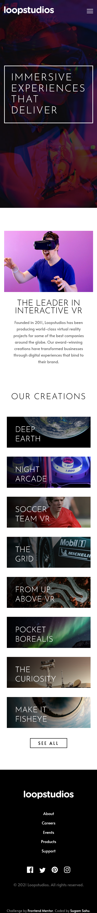

# Challenge No - 5
## Frontend Mentor - Loopstudios landing page solution

This is a solution to the [Loopstudios landing page challenge on Frontend Mentor](https://www.frontendmentor.io/challenges/loopstudios-landing-page-N88J5Onjw). Frontend Mentor challenges help you improve your coding skills by building realistic projects. 

### The challenge

Users should be able to:

- View the optimal layout for the site depending on their device's screen size
- See hover states for all interactive elements on the page

### Screenshot

#### Challenge Screenshots

#### Solution Screenshots

### Links

- Solution URL: [Solution](https://github.com/iSugam/loopstudios-landing-page-frontend-mentor)
- Live Site URL: [Live Site](https://isugam.github.io/loopstudios-landing-page-frontend-mentor/)

## My process

### Built with

- HTML5 markup
- CSS custom properties
- Flexbox
- CSS Grid
- JavaScript

### Continued development

As it's still not pixel perfect, I am still going to develop till I can create pixel perfect websites just from screenshots.

## Author

- Website - [Sugam Sahu](https://www.sugamsahu.com)
- Frontend Mentor - [@iSugam](https://www.frontendmentor.io/profile/iSugam)
- Twitter - [@sugam-sahu](https://www.linkedin.com/in/sugam-sahu/)